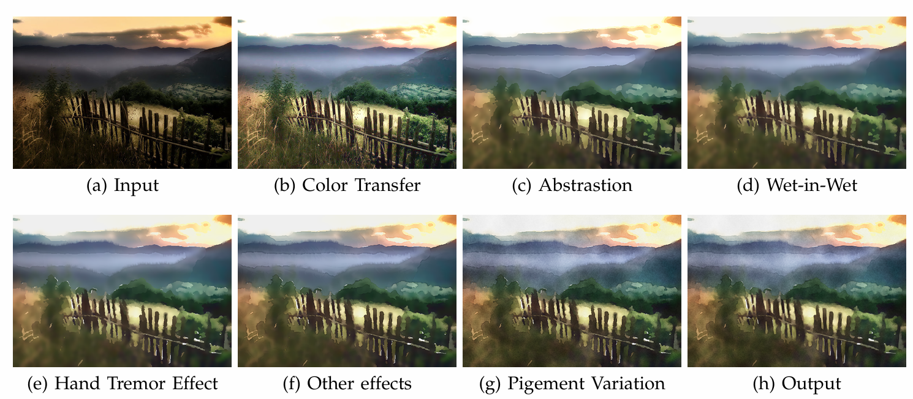

# CSCI 1290 Project X Report

# Proposal - Watercolorization with Artistic Verismilitude
Anna Le, Mariia Sidorova

For our final project, we wanted to implement a realistic watercolor filter that can be applied to images to emulate what a watercolor painting would look like if it was used as a reference photo by a real artist. We are basing this process off of this paper (https://www.cs.columbia.edu/cg/raymond/watercolor/watercolor_pp.pdf). The process is broken down into four core ideas: color adjustment, saliency distance fields, wet-in-wet brush effect, and hand tremor effect. We do not need any extra equipment as of right now since we should be able to use images/data found online to build this project from. The data we will be capturing includes best color palette matching for image to watercolor, so that color schema reflects a realistic mapping. The saliency distance field will help us determine what details in the image are important and need to be emphasized versus what can be blurred/ignored. The saliency will then be used to determine where a wet-in-wet feather-like filter should be applied to make boundaries more distinct/blended as well as where to apply a tremor effect (noise) to mimic the tremors of an actual human hand while painting with watercolors. We will specifically be focusing on image boundaries, detail emphasis, and noise application.

# Results report

Part 1: XXXX

Part 2: YYYY

## Hero image:

![My hero image]

---
---

# Example Markdown

The rest of this document contains example Markdown for your convenience.

## In the beginning...

## Interesting Implementation Detail
